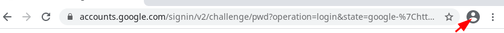
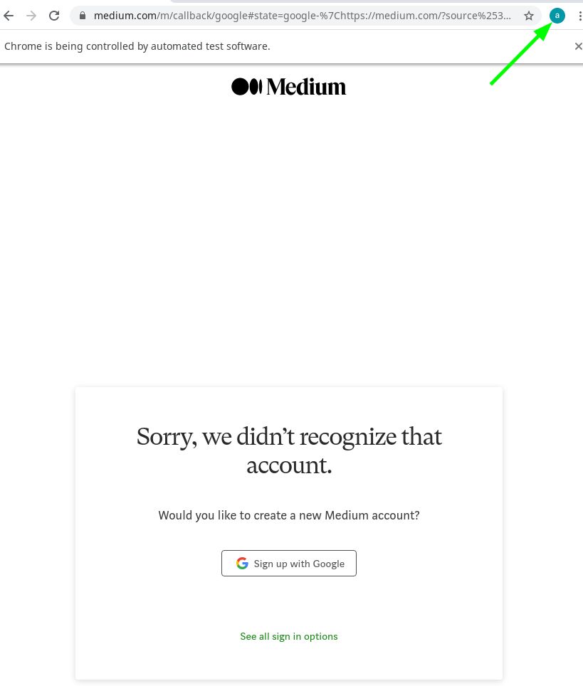

# Table of Contents

1.  [Description](#org4b2e7d6)
2.  [Installation](#org8d75d1c)
3.  [Usage](#org210bb27)
    1.  [Log into google manually](#org2f857ce)
4.  [Requirements](#org77)
5.  [How does it work?](#org74bf8b7)
6.  [FAQ](#org59429c4)
    1.  [Why do I need to sign in to google over `medium.com` ?](#org985e7f2)

    2.  [Why do I need to log in manually?](#org99)
7.  [License](#org73af18b)


<a id="org4b2e7d6"></a>

# Description

This script extract your youtube subscriptions and parse it into a json. The json-format is adapted to work with the NewPipe application <https://github.com/TeamNewPipe/NewPipe>


<a id="org8d75d1c"></a>

# Installation

1.  Clone the repo

2.  `cd` into the cloned repo

3.  Execute the following to install all necessary packages into a virtual environment and change into it
    
        source ./install.sh
    
    if you want to exit the virtual environment just type:
    
        exit


<a id="org210bb27"></a>

# Usage

If it does not scroll down far enough that you can see all your subscriber: add the `--scroll` option and
choose a value bigger than the default option `100` like

    python youtube-json-parse.py --scroll 200


<a id="org2f857ce"></a>

## Log into google manually

1.  start the program by
    
        python youtube-json-parse.py
2.  Go to <https://medium.com/> , why medium not Google? see [FAQ](#org59429c4)
3.  Click on Sign In
4.  Sign In with Google

Even if the message `"Sorry, we didn’t recognize that account."` comes,
you are logged in.
Quick Check: If you can see your icon next to the url bar, then you are logged in


<table><tr>
<td></td>
<td></td>
</tr></table>


5. Press Enter, program takes care of the rest

6. After the programs finish, you can exit the virtual environment by typing:


    ```exit```

7. A file `subscriptions.json` was created which can be used on [NewPipe](https://github.com/TeamNewPipe/NewPipe)

<a id="org77"></a>

# Requirements

Only python3 is required

Works on GNU/Linux but it should work on Mac and Windows as well.

# How does it work?

It uses selenium, selenium can automate web browsers and this project uses it to get the youtube subscriptions because it is a list, which needs javascript to get loaded (&rsquo;infinity pages&rsquo;).

It calls the [https://www.youtube.com/feed/channels?app=desktop](https://www.youtube.com/feed/channels?app=desktop)
site, scrolls down to get all subscriptions. Scrape the website and creates the json file which can imported to [NewPipe](https://github.com/TeamNewPipe/NewPipe)


<a id="org59429c4"></a>

# FAQ


<a id="org985e7f2"></a>

## Why do I need to sign into google over `medium.com` ?

Answer: Because google does not allow to log into your account with selenium directly through googles &rsquo;sign up&rsquo; site.


<a id="org99"></a>

## Why do I need to log in manually?
Answer: Because I **don't** want to store your password in a variable. It could
feel less secure and vulnerable. I considered to use a `--lazy` option but before
I receive any complaints, I dropped it. So the only option is to log into google
on your own, through medium.

<a id="org73af18b"></a>

# License

MIT License

Copyright (c) 2020 dmorady1

Permission is hereby granted, free of charge, to any person obtaining a copy
of this software and associated documentation files (the &ldquo;Software&rdquo;), to deal
in the Software without restriction, including without limitation the rights
to use, copy, modify, merge, publish, distribute, sublicense, and/or sell
copies of the Software, and to permit persons to whom the Software is
furnished to do so, subject to the following conditions:

The above copyright notice and this permission notice shall be included in all
copies or substantial portions of the Software.

THE SOFTWARE IS PROVIDED &ldquo;AS IS&rdquo;, WITHOUT WARRANTY OF ANY KIND, EXPRESS OR
IMPLIED, INCLUDING BUT NOT LIMITED TO THE WARRANTIES OF MERCHANTABILITY,
FITNESS FOR A PARTICULAR PURPOSE AND NONINFRINGEMENT. IN NO EVENT SHALL THE
AUTHORS OR COPYRIGHT HOLDERS BE LIABLE FOR ANY CLAIM, DAMAGES OR OTHER
LIABILITY, WHETHER IN AN ACTION OF CONTRACT, TORT OR OTHERWISE, ARISING FROM,
OUT OF OR IN CONNECTION WITH THE SOFTWARE OR THE USE OR OTHER DEALINGS IN THE
SOFTWARE.

